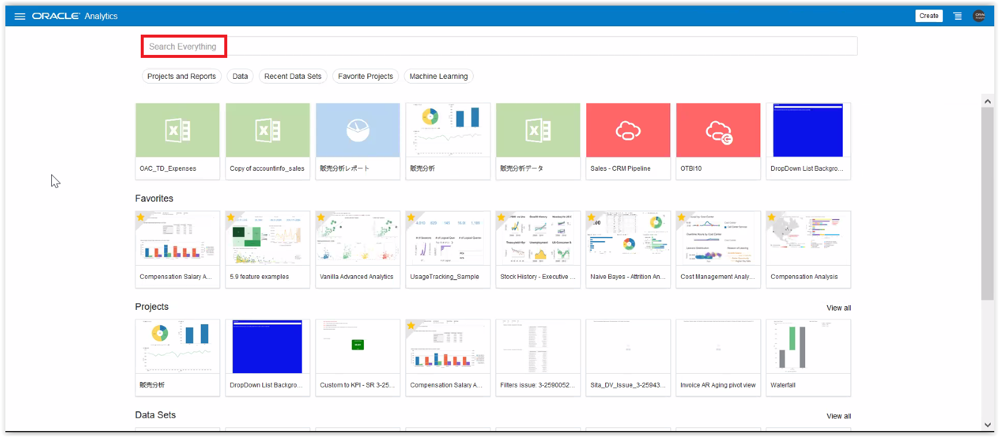
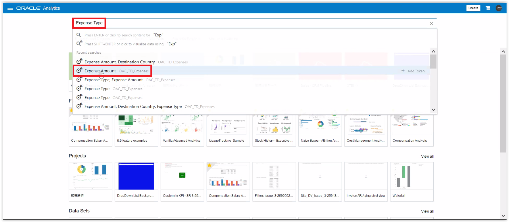
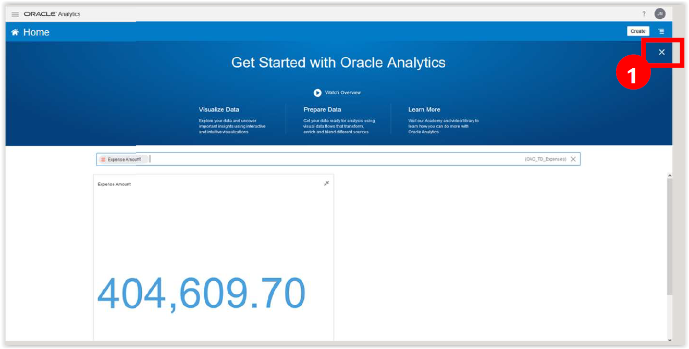
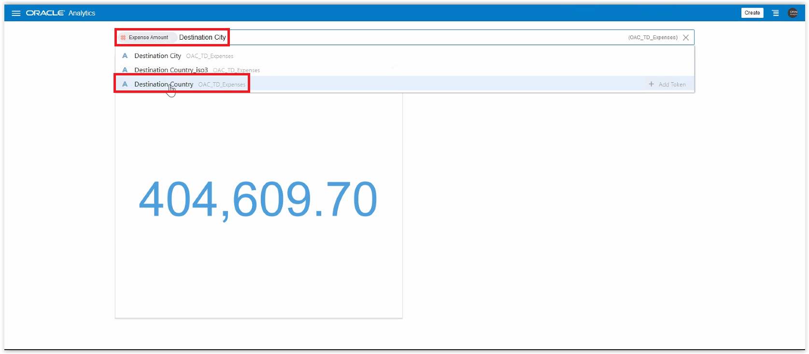
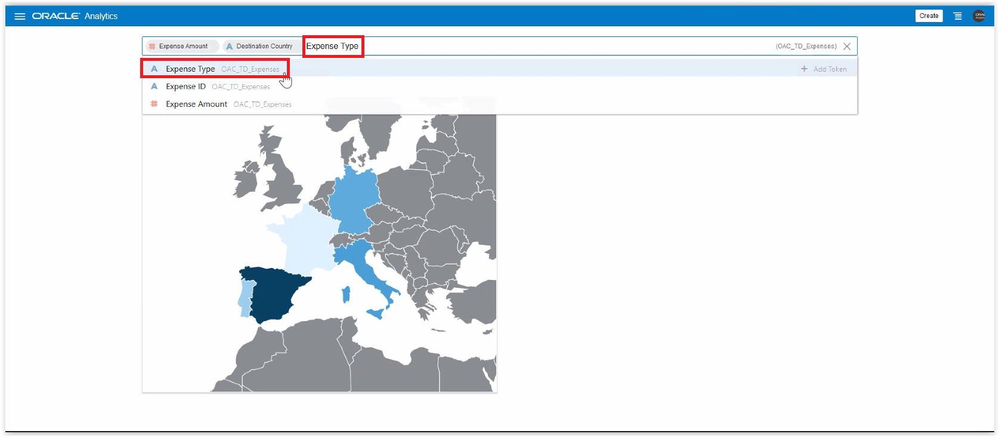
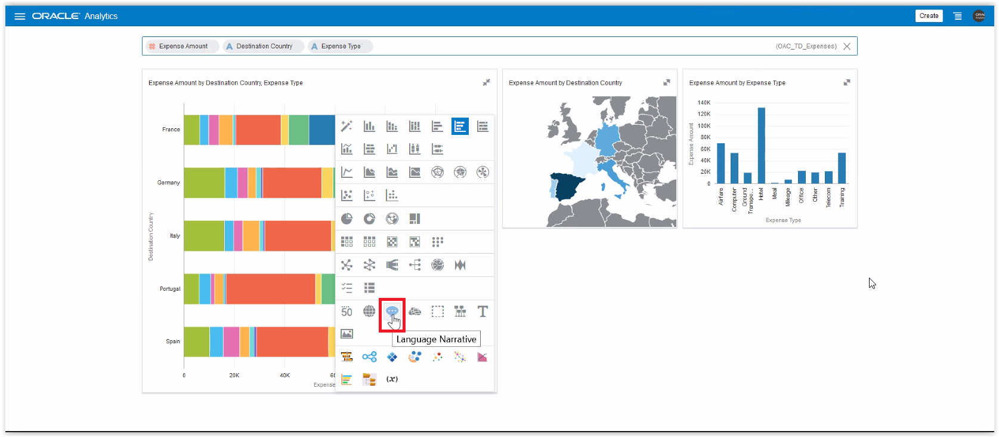
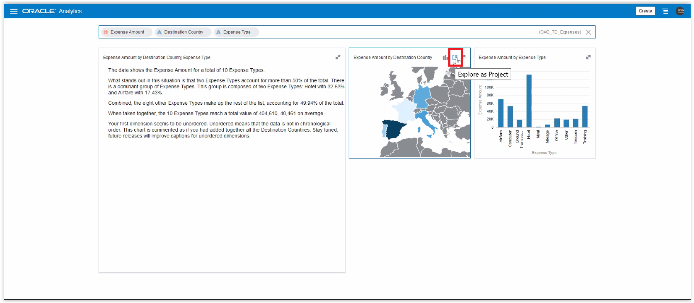

# Exercise 2: Getting insights by search

## Scenario

“Well. Getting data in the tool was quite simple. But analyzing tables is boring… unless you can ask the tool which data you want and let it get the visualization for you :-)
You wonder how many coffee breaks will take you to get the analysis done.”

__SUMMARY__

In this exercise you will use the BIAsk search bar to start getting some insights about expenses data.
Search bar allows you to find objects like projects and reports. Or also to query data and find answers using “tokens” (querying one item at a time) or by natural language queries.

Estimated Lab Time: 15 minutes

### Objectives

* Getting Familiar with BI Ask
* Building more visualizations using the BI ASK

### Prerequisites
* Logged in to OAC

## **Step 1**: Getting Familiar with BI Ask

Now that your data is loaded and the crawler has indexed it, you can start getting some results using the Search Bar.

First thing would be to find more info about the expenses
1. Click on the “Search Everything” bar

1. Start typing “Expense”. 
It will try to auto-complete the value for you. It will also display a list of options to you for choosing the right one.

2. Select “Expense Amount” from your Dataset 
Note that close to the field we have the name of the Dataset where this item is found.

The icon at the start identifies whether is a Dimension (A) or a Measure (#)

OAC queries the data and presents it using the best visualization for the type of data you request.

In this case, as you searched for expenses OAC shows the total amount. You can make some more room for the results by closing the “Get Started Banner”
1. Click on the top right X

Total amount of Expenses by itself tells you nothing. You now want to see this amount distributed by country to see if there is an outlier there.
1. Start typing “Destination”.
2. On the drop-down list choose “Destination Country”

A map is produced. Color gives you an idea of the total expenses by country. You see that Spain is spending more.

But you don’t know which type of expenses are. You decide to add that.
1. Start typing “Expense”
2. From the drop-down list choose “Expense Type”

## **Step 2**: Building more visualizations using the BI ASK

Now you have 3 graphics that show the different combination of “tokens” used in the search bar.

Visualizations can be adjusted to other types and although you are smart enough to understand the bars, another visualization might be better.
1. Hover on the top right corner of the graphic and click on “Change Visualization Type” (a vertical bar icon)

A long list of visualization types appears.
1. Choose “Language Narrative” (balloon with 3 dots)

Now you can quickly read and see that Hotels and Airfares were the top contributors.

Good, this is getting interesting. Search bar is great for a quick answer, but it’s now time to get serious and explore in detail. Now you open this in a project.
1. Hover over the right top corner and click on “Explore as Project”

## End of Exercise 2