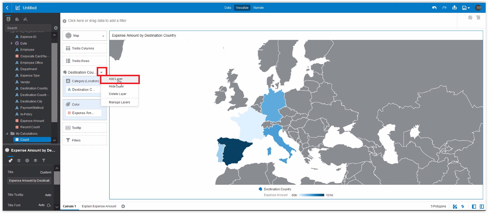
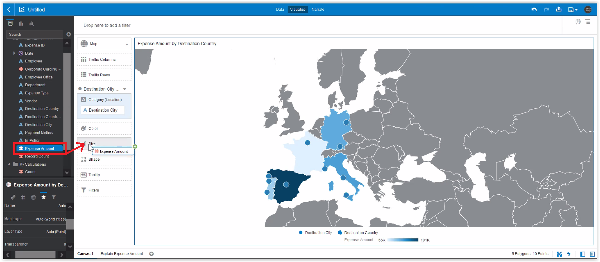
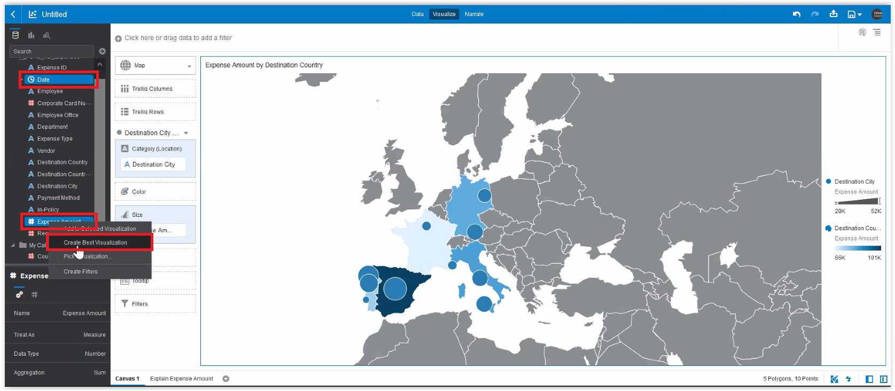
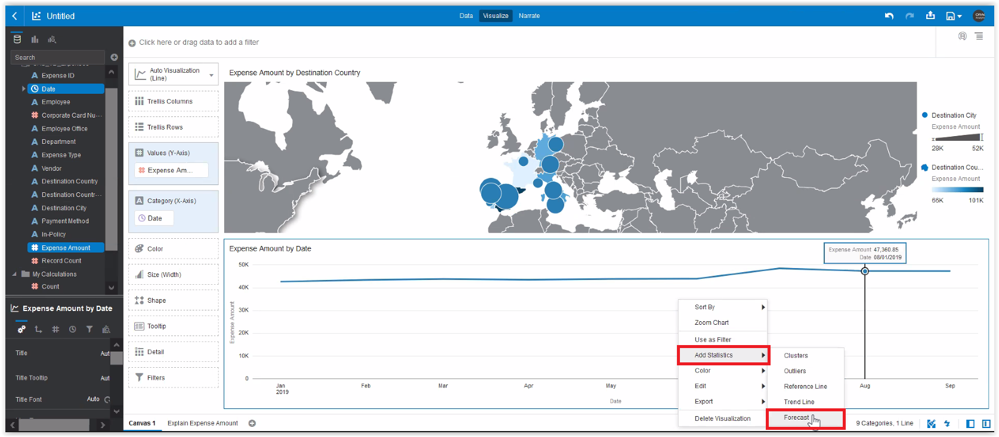
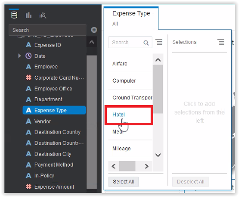
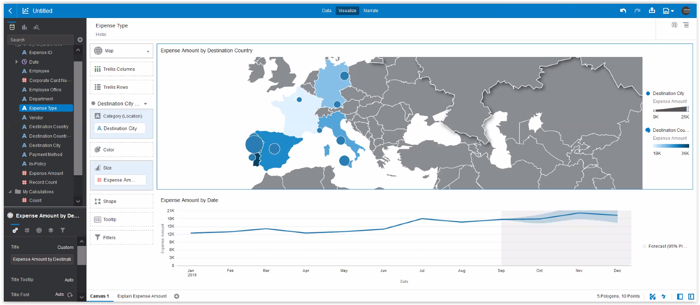
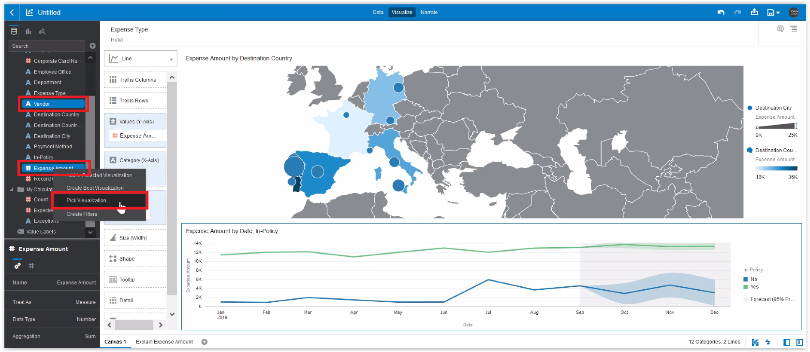
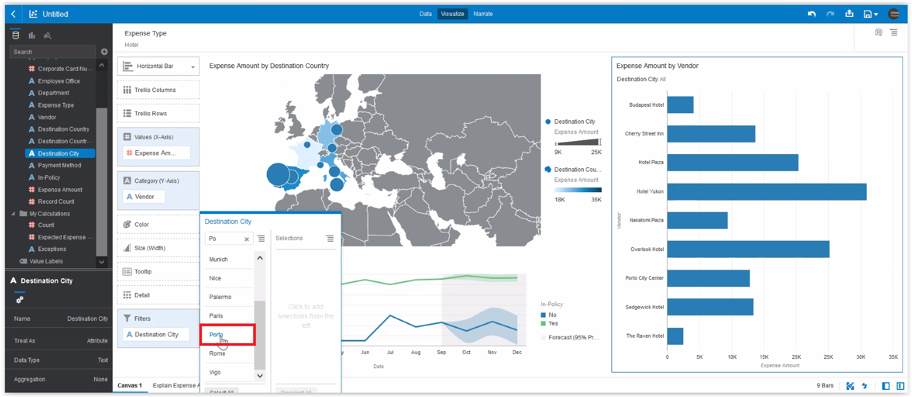
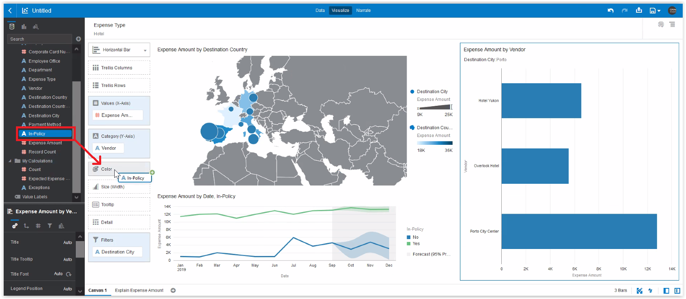
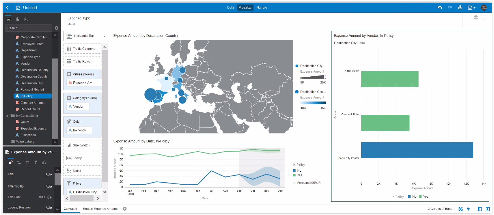

# Exercise 4: Augmented Analytics

## Scenario

“More important than knowing why we had an error is to know if we will have it again. Same way, knowing who overspent is not our only goal. Although would be good to know if the culpable was by any chance the same guy that get you into this… for no special reason, of course.”

__SUMMARY__

In this exercise you will experiment how easy and dynamic is to create your own analysis.
Augmented capabilities like automatic map layers and forecasting will be used.

Estimated Lab Time: 30 minutes

### Objectives

* Working with maps
* Apply one-click forecast
* Exploring all the filtering options

### Prerequisites
* Logged in to OAC

## **Step 1**: Working with maps 

You are back to Canvas1. The results from previous exercise gives you the topics to analyze deeper.
You want to start by adding detail information of cities to your current map.
Check that the map visualization has a blue thin border around it. If not, click anywhere on the map to select it.

You can combine several layers of information in a map. Create a new one for the city info.
1. Click on the Hamburger icon on the top right of the Layer menu
2. Select “Add Layer”

A new layer by the name of “Layer 2” is created. You can change the name and edit its properties. But for your purposes is enough as it is.
You add the city to the map.
1. Click and Drag “Destination City” to the Category (Location). A small green plus icon appear informing that it will be added.

Location of the destination cities appear on the map. You now want to add the Expense information to see how much was spent by city.
1. Select and Drag “Expense Amount” to “Size” The size of the bubble represents the amount spent on each city.

## **Step 2**: Apply one-click forecast

Now you want to see the overall trend of expenses by date.
1. Hold control key of your keyboard (Ctrl) and Click on “Date”
2. Keep Ctrl hold and now click on “Expense Amount”
3. Right click and choose “Create Best Visualization”

This will create a new analysis using the best type of visualization for the information selected. In this case a Line Chart.
This graphic shows that there was an increase in expenses in the past few months.
Now you want to see the prediction of Expenses for the future using Machine Learning.
1. Right-click on the line chart (on any empty space) and select “Add Statistics”
2. Select “Forecast”

You get a prediction for the next 3 periods (months). And you see that
The tool allows you to choose from different Forecast Algorithms.
On the properties menu at the bottom left you can configure more aspects of the visual.
1. Click on the “Analytics” icon on the properties menu (most right icon)
2. Under “Method” click on “Seasonal ARIMA” and choose “ARIMA” (company expenses are not seasonal, so makes more sense to use normal ARIMA model)

Note that the forecast changes as now is using ARIMA method.

## **Step 3**: Exploring all the filtering options

Prediction is adjusted but still bad. You want to focus now on Hotel expenses.
1. Select “Expense Type” and drag it to the Filter Bar at the top

1. Find “Hotel” and click on it

All visuals on the canvas get filtered to “Hotel”
You clearly see that the city with higher hotel expenses was Porto (you can hover the bigger bubble to see the detailed pop-up)
On the graph below, the increase trend of expenses for hotels is still there.
A solid proof that Hotels is one of the root issues here.

To confirm your analysis, you want to check if expenses were out of policy.
1. Select “In Policy” and drag it to “Color”

Out of policy expenses in hotels had a peak around July. You wonder which hotels are causing this.
1. Hold control key of your keyboard (Ctrl) and Click on “Vendor”
2. Keep Ctrl hold and now click on “Expense Amount”
3. Right click and choose “Pick Visualization”

A wide variety of visualization are available to you.
1. Click on the “Horizontal Bar” Visualization

The list of Hotel vendors appears. Now you need to filter it to Porto and to find the related ones.
1. Click “Destination City” and drag it to “Filters”

1. On the filters menu find and choose “Porto”. You can use the search box at the top to short the list of options.

You see only 3 hotels in Porto. You want to see if our company already has an agreement with them or they are out of policy.
1. Select and Drag “In-Policy” to Color

Great. Now you know that overspending issue was due to Hotel bookings in Porto in the “Porto City Center” hotel by Sales Department (remember Sales department
was highlighted by the Explain).
Someone could say you have finish, but you are a professional that looks for outstanding results.
You try to walk the extra mile in the next exercise.

## End of Exercise 4