# Exercise 5: Adding more Datasets

## Scenario

“Wait a sec! I remember this Hotel. And I know we have a discount on it because I spent my last summer holidays there. I can save a good money to the company. I’m sure this is my ticket to a management position… well knowing my boss I might just get a kudos email if anything :-S”

__SUMMARY__

In this exercise you will incorporate a new dataset to finalize your analysis. 

OAC provides a very easy way of joining different datasets to combine information from several sources. After that you will work on creating a calculation and finally arranging the results and personalizing the outcomes to end with a nice analysis that can be now share back.

Estimated Lab Time: 30 minutes

### Objectives

* Add additional data set
* Join different datasets
* Use calculations on your datasets

### Prerequisites
* Logged in to OAC

## **Task 1**: Add additional data set

Donwload the file: [OAC_TD_Agreements.xlsx](https://objectstorage.eu-frankfurt-1.oraclecloud.com/p/QvH_te7x8a9YUSU4Z2x6nDo32I8EIHyFFpgpLD6_mlevelfbr3RtsM4WFa1AyRNe/n/interactivetech/b/OAC-CTD/o/OAC_td_agreementsOAC_TD_Agreements.xlsx)

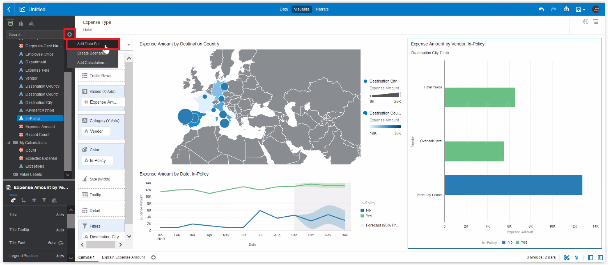

To confirm that Hotel had already an agreement and the savings they have to claim to the hotel chain, you need to add that information from another excel with the list of vendor agreements.
1. Click on the plus icon at the top right of the Explorer menu and select “Add Data Set”

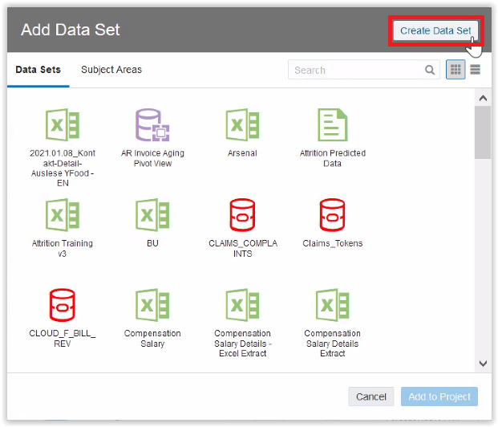

You need to upload this new file.
1. Click “Create Data Set”

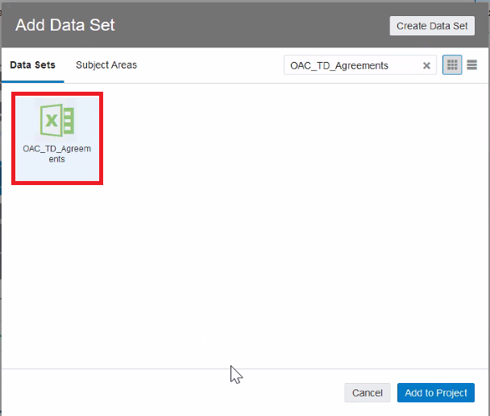

1. Click on “Drop data file here or click to browse”

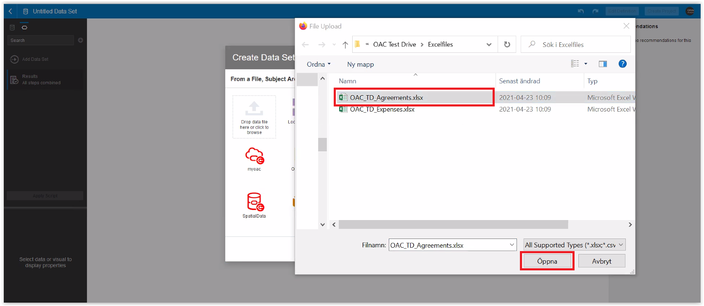

1. Search for the other excel file on your exercises folder by the name of “OAC_TD_Agreements.xlsx”
2. Click “Open”

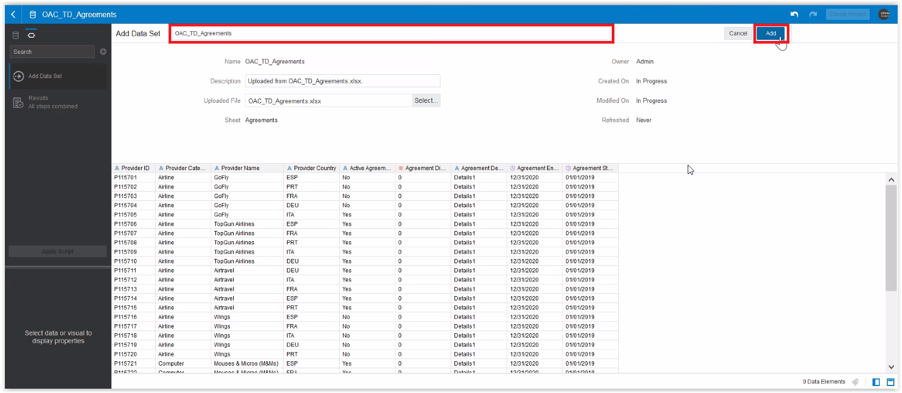

You see a preview of the data. Note that this file has the country column with ISO3 code. It is really good that we got the recommendation to add ISO3 code to the expenses one.
1. Change the Name of the dataset adding your initials at the end, to avoid clashing with other attendees, for instance: OAC_TD_Agreements_JAMP
2. Click on “Add”

## **Task 2**: Join different datasets

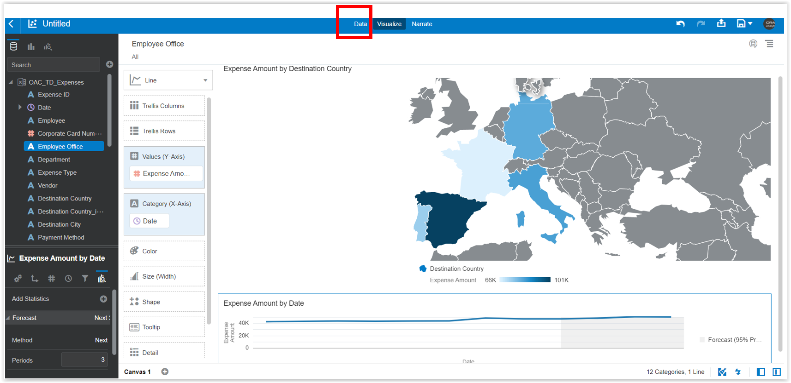

New Data Set gets added and we are led to the Prepare Tab (see at the top right corner of the screen).
Here you have a tab for each dataset in the project plus one that defines the relationships between them.
1. Click on “Data Diagram” tab

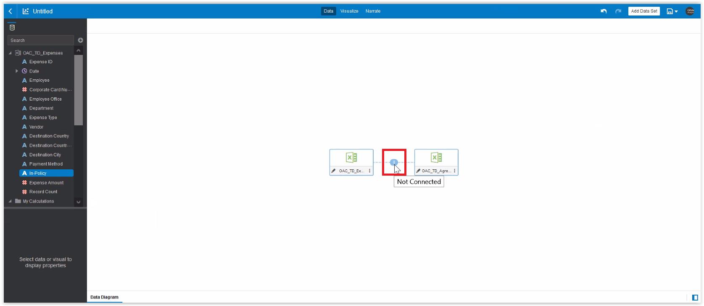

As files are not related you see them as isolated boxes on the canvas. You will define the join.
1. Hover over the imaginary line between the datasets and click on the 0 that will appear

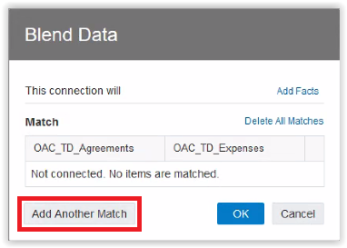

On the pop-up menu, define the join.
1. Click on “Add Another Match”

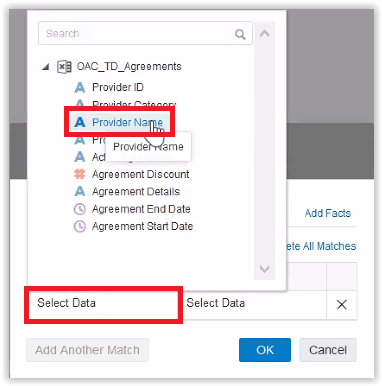

Join of these files are between “Provider Name” = “Vendor”.
And “Provider Country” = “Destination Country_ISO3” because a hotel chain might have the same name in different countries.
1. Click on the small down arrow to expand the list of columns of the first data set
2. Click “Provider Name”

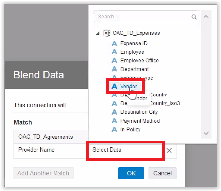

1. Now click on the down arrow on the second dataset to expand the drop-down list.
2. Click on “Vendor” Now you have defined a join between “Provider Name” and “Vendor”.

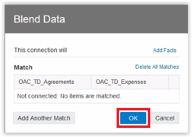

1. Repeat the steps 8-10 and select “Provider Country” and “Destination Country_iso3”.
You should have something like the screenshot.
Then click OK.

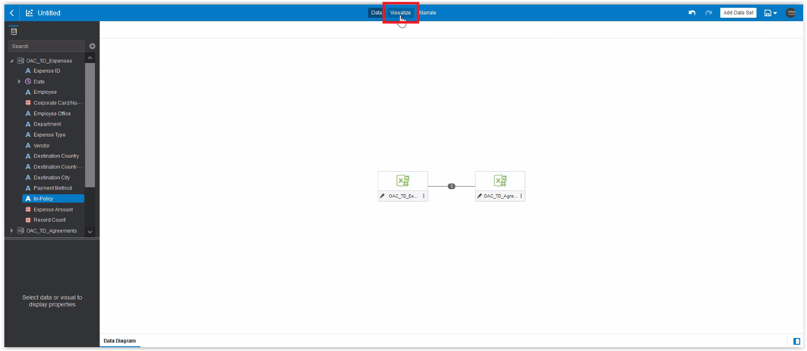

Once the join has been defined you can go back to the Visualize tab to continue your analysis.
1. Click on “Visualize” at the top right.

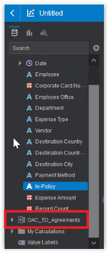

On the Explorer menu at the left you note that the new Data Set has been added.
1. Click on the arrow on the left to the data set to expand it.

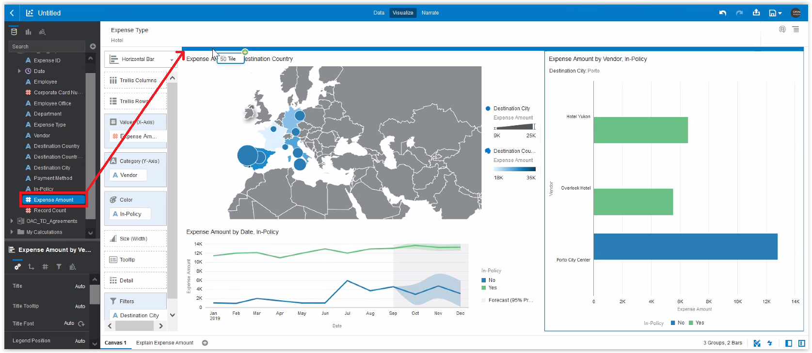

You want to compare the total Hotel Expenses with the amount that can be saved if the company claims the Hotel Chain to apply the agreement.
1. Click and Drag “Expenses Amount” to the top of the canvas. Check that a blue bar appears at the top covering the whole canvas and not only a small part of it.

## **Task 3**: Use calculations on your datasets

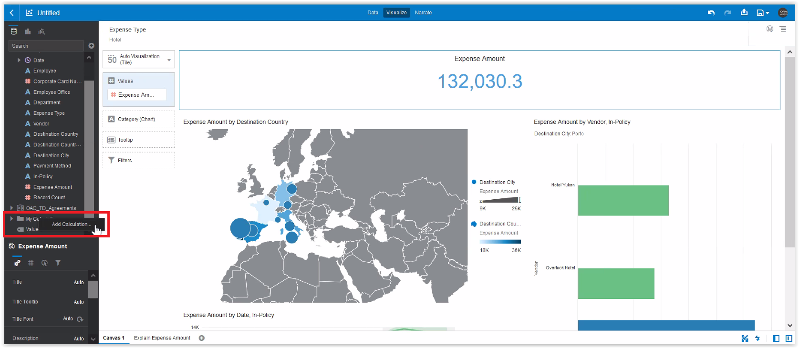

To obtain the savings you need to calculate the expenses multiplied by the agreement discount (that has not been applied).
1. Select “My Calculations” and Right-click on it.
2. Select “Add Calculation”

My calculations are at the bottom of the explorer, use the slider to find it if your screen resolution is too small and it is not appearing.

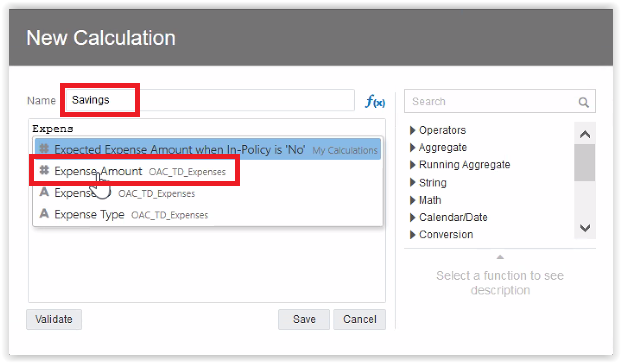

On the pop-up window you can define the formula of the calculation using the editor.
1. Put the name “Savings” to the calculation
2. On the expression box start typing “Expense” and choose “Expense Amount” from the dropdown list.

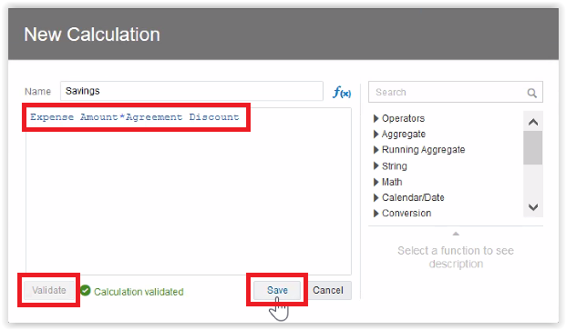

1. Now type “*” (asterisk) to multiply the value and start typing and select “Agreement Discount”
Your formula should look like the screenshot.
2. Click on “Validate” to confirm everything is ok.
3. Click on “Save”

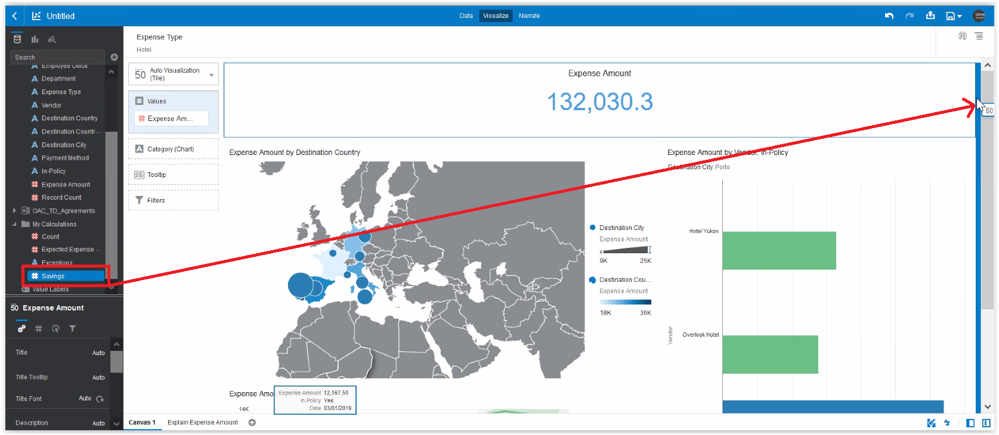

1. Click and Drag the new calculation “Saving” to the top right part of the canvas.
Check that the vertical blue bar only covers the “Expenses Amount” right border. This means the visual will be placed next to it.

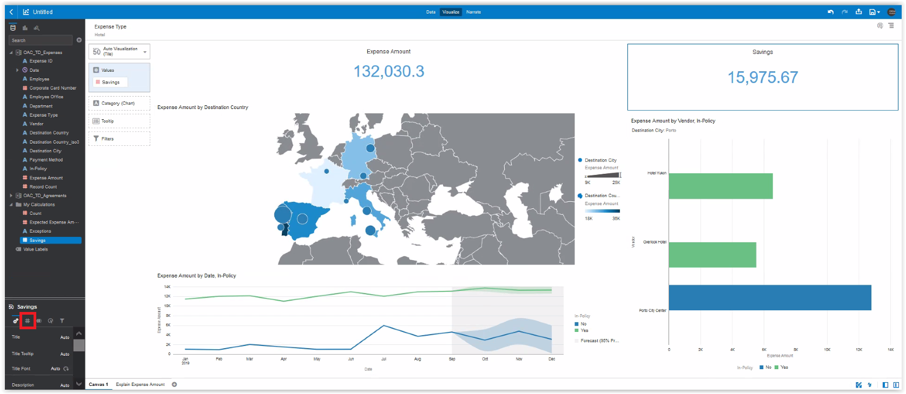

Great. Now you would like to make this more appealing so you will work on the look and feel.
1. On the properties box select the 2nd tab with the hash icon.

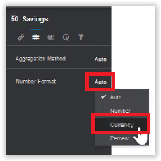

1. Look for the “Number Format” parameter and click on “Auto”
2. Select “Currency”

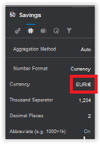

1. Look for the “Currency” parameter and click on the value “$”. Search for your currency in the list and select it.

1. Look for the “Abbreviate” parameter and click on the “Off” value to make it “On”

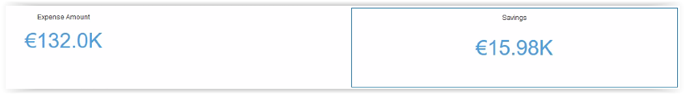

Repeat the steps 20-22 for the “Expense Amount” tile (remember to first select the visual by clicking on it. Selected visual has a thin blue border).

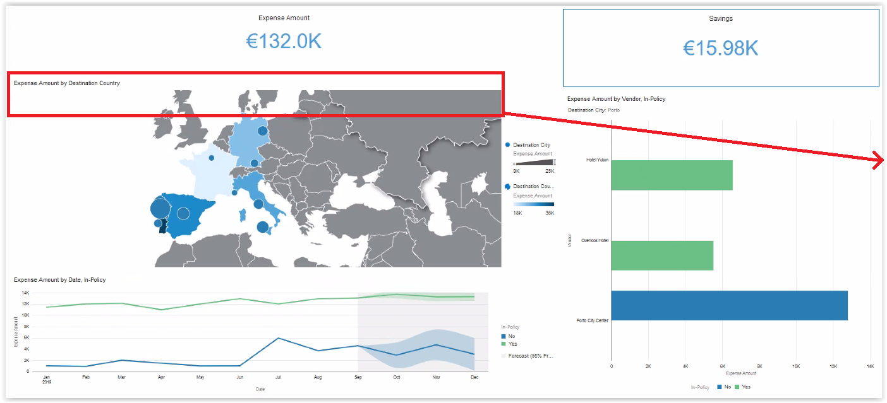

1. Click on the Map and Drag it to the right border of the canvas

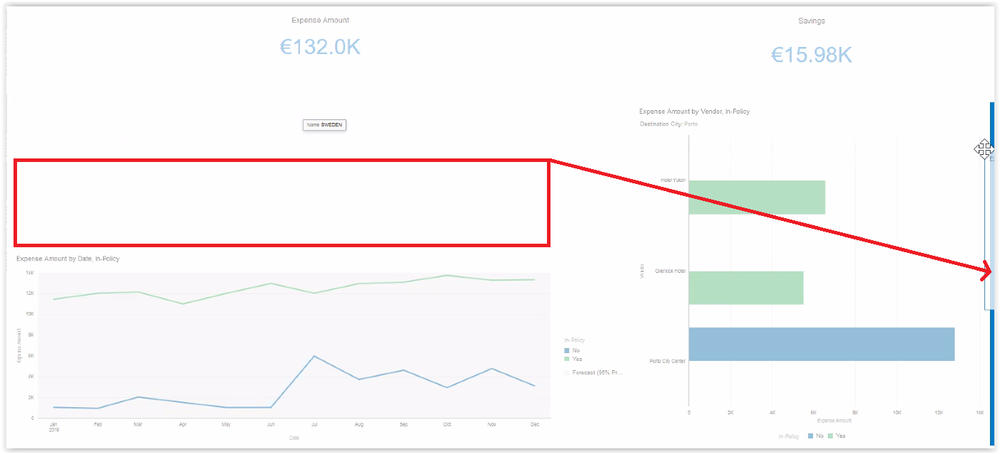

1. Drop it when the blue bar shows that Map will be placed next to the Horizontal Bar visual but not covering the whole right border.

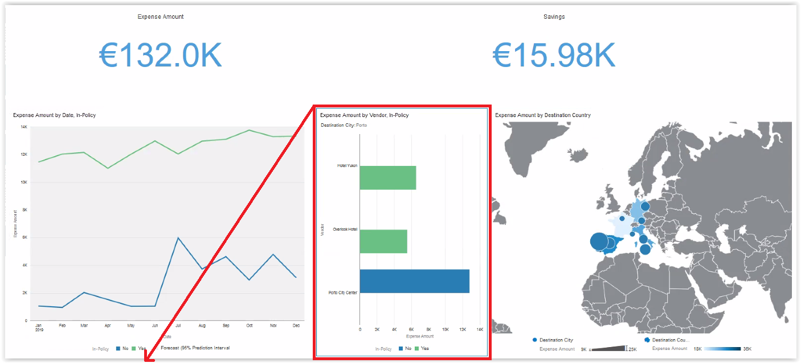

1. Click on the Horizontal Bar visual and drag it to the bottom left, under the Line Chart

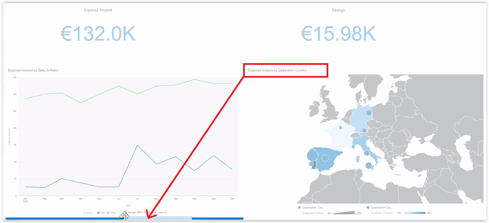

1. Drop it when the blue bar shows that will be under the line chart but not the whole bottom line.

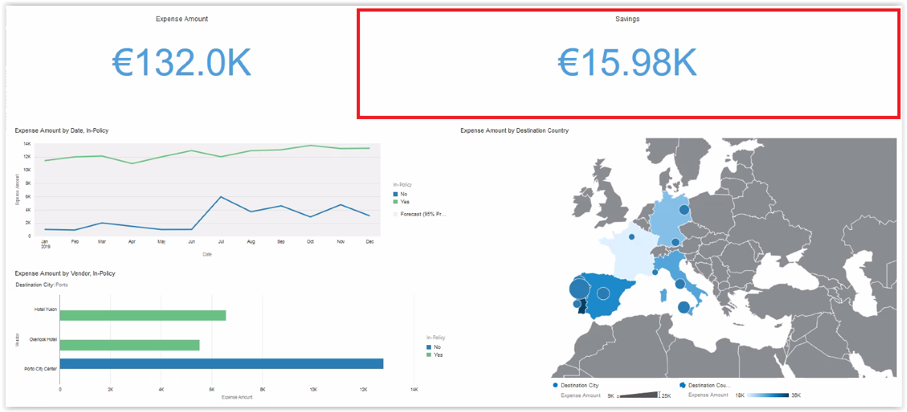

1. Click on the Savings visual to select it.

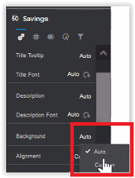

1. On the properties box, search for the “Background” parameter and click on “Auto” to switch to “Custom”

1. Under the new options of “Custom” search for the “Fill Color” parameter and click on the white box.
2. Select a green color (no need to be the same, but if you like you can copy the code on the hex box: #68c182)
3. Click on OK to apply the changes.

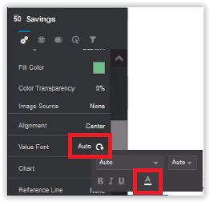

1. On the properties box, search now for the “Value Font” parameter and click on “Auto”.
2. On the pop-up click on the Font Color Icon and choose white from the available colors.

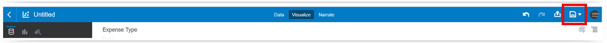

Great. This is a nice dashboard now. You can save your work.
1. Click on “Save” at the top right corner.

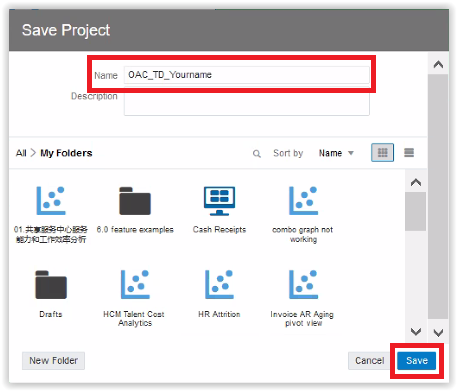

1. Put a name to your project.
2. Click on “Save”

**Well done!** You have completed all exercises. Now you are ready to show this info to your manager.

## End of Exercise 5